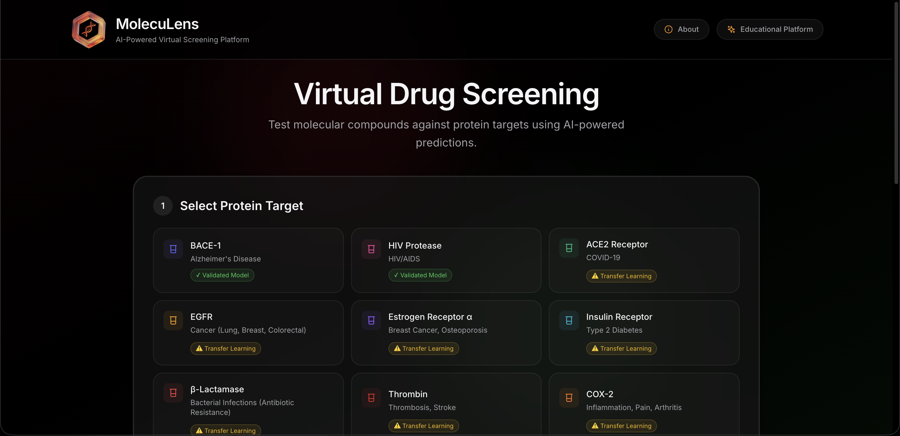
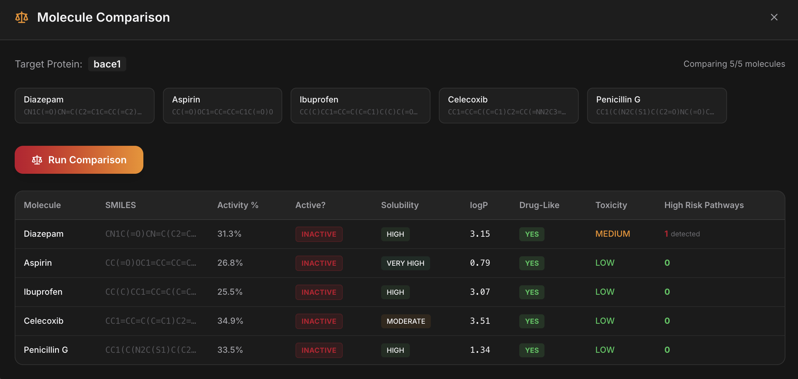
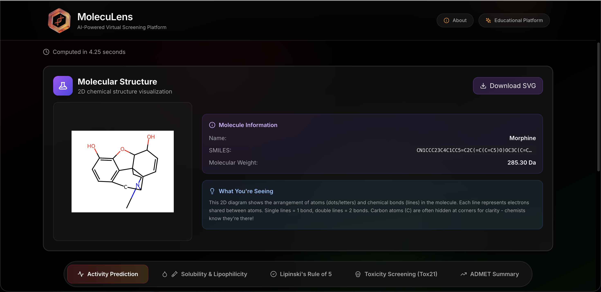

# 🧬 MolecuLens — AI-Powered Drug Discovery Platform

> *Bringing AI Drug Discovery to Education*

[](https://deepchem-frontend-705710699642.us-central1.run.app/)
[](https://python.org)
[](https://nextjs.org)
[](https://deepchem.io)
[]()

<div align="center">

**[🚀 Live Demo](https://deepchem-frontend-705710699642.us-central1.run.app/)** • **[📖 API Docs](https://deepchem-backend-705710699642.us-central1.run.app/docs)**

</div>

---

## 📖 Overview

**MolecuLens** is an educational web platform that enables students to explore drug discovery using artificial intelligence. Test any molecule against disease protein targets and get instant predictions on activity, solubility, toxicity, and more — all without expensive lab equipment.

> 🔬 **Developed for Thompson Rivers University** — Designed as an educational tool for chemistry and biology courses.

### 🎯 The Problem We Solve

Traditional drug discovery is:
- ⏰ **Time-consuming**: Takes 10-15 years to develop one drug
- 💰 **Expensive**: Costs $1-2 billion per drug
- 🧪 **Resource-intensive**: Requires specialized lab equipment
- 📉 **High failure rate**: 90% of drug candidates fail in clinical trials

MolecuLens is a **virtual drug screening lab** that allows students to test molecules against disease proteins **instantly** (2-3 seconds).

---

## ✨ Key Features

<table>
<tr>
<td width="50%">

### Core Predictions
- 🎯 **Activity Prediction** (85-93% accuracy)
- 💧 **Solubility (logS)** (~75% accuracy)
- 🧪 **Lipophilicity (logP)** (~78% accuracy)
- ✅ **Drug-Likeness** (Lipinski's Rule of 5)
- ☠️ **Toxicity Screening** (12 pathways, ~80%)
- 📊 **ADMET Summary**

</td>
<td width="50%">

### Platform Features
- 🧬 **2D Molecular Structure Visualization** (RDKit.js)
- 🔍 **20 Pre-loaded Example Molecules**
- ⚖️ **Side-by-Side Comparison** (up to 5 molecules)
- 🎨 **Dark Mode UI** with smooth animations
- 📥 **Custom SMILES Input**

</td>
</tr>
</table>

### Supported Protein Targets

| Protein | Disease Target | Confidence |
|---------|----------------|------------|
| **BACE-1** | Alzheimer's Disease | ⭐⭐⭐ High |
| **HIV Protease** | HIV/AIDS | ⭐⭐⭐ High |
| ACE2 | COVID-19 | ⭐⭐ Medium |
| EGFR | Cancer | ⭐⭐ Medium |
| ER-α | Breast Cancer | ⭐⭐ Medium |
| Insulin Receptor | Diabetes | ⭐⭐ Medium |
| β-Lactamase | Antibiotic Resistance | ⭐⭐ Medium |
| Thrombin | Blood Clots | ⭐⭐ Medium |
| COX-2 | Inflammation/Pain | ⭐⭐ Medium |
| Dopamine D2 | Schizophrenia | ⭐⭐ Medium |

---

## 🎨 Screenshots

<table>
<tr>
<td width="50%">

### Home Page — Molecule Input


</td>
<td width="50%">

### Comparison Panel


</td>
</tr>
</table>

### Results Dashboard


---

## 🔬 How It Works

```
1️⃣ Select Protein Target    →    2️⃣ Choose/Enter Molecule    →    3️⃣ Click "Analyze"
         ↓                                   ↓                              ↓
    BACE-1 (Alzheimer's)              Aspirin (SMILES)              AI Processing
         ↓                                   ↓                              ↓
4️⃣ View Results Dashboard   ←    5️⃣ Get Predictions (2-3s)   ←    ML Models Run
```

### Technical Pipeline

```
┌─────────────────┐         HTTPS          ┌──────────────────┐
│     Browser     │◄──────────────────────►│   Next.js App    │
│    (Student)    │                        │   (Frontend)     │
└─────────────────┘                        └────────┬─────────┘
                                                    │ API Call
                                                    ▼
                                           ┌──────────────────┐
                                           │   FastAPI        │
                                           │   (Backend)      │
                                           └────────┬─────────┘
                                                    │
                         ┌──────────────────────────┼──────────────────────────┐
                         ▼                          ▼                          ▼
                  ┌─────────────┐           ┌─────────────┐            ┌─────────────┐
                  │ Activity    │           │ Solubility  │            │ Toxicity    │
                  │ Model       │           │ Model       │            │ Models (12) │
                  └─────────────┘           └─────────────┘            └─────────────┘
```

---

## 🛠 Tech Stack

### Frontend

| Technology | Purpose |
|------------|---------|
| **Next.js 14** | React framework with SSR |
| **TypeScript** | Type safety |
| **Tailwind CSS** | Styling framework |
| **Framer Motion** | Animations |
| **RDKit.js** | Client-side molecular rendering (WebAssembly) |
| **Recharts** | Data visualization |

### Backend

| Technology | Purpose |
|------------|---------|
| **Python 3.9** | Runtime |
| **FastAPI** | Web framework |
| **DeepChem 2.7.1** | Drug discovery ML library |
| **RDKit** | Chemistry toolkit |
| **scikit-learn** | Machine learning |

### Infrastructure

| Service | Purpose |
|---------|---------|
| **Google Cloud Run** | Container hosting (auto-scaling, HTTPS) |
| **Artifact Registry** | Docker images |
| **Cloud Build** | CI/CD pipeline |

---

## 🧠 Machine Learning Models

All models were trained using **DeepChem** and **scikit-learn**:

| Model | Dataset | Samples | Algorithm |
|-------|---------|---------|-----------|
| **BACE-1** | MoleculeNet BACE | 1,210 | RandomForest (1000 trees) |
| **HIV Protease** | MoleculeNet HIV | 41,127 | RandomForest (500 trees) |
| **Solubility** | Curated | ~9,000 | RandomForest (500 trees) |
| **Lipophilicity** | MoleculeNet | 4,200 | RandomForest (500 trees) |
| **Toxicity** | Tox21 | 12,000 | RandomForest × 12 |

**Molecular Fingerprints**: All molecules are converted to **ECFP (Extended Connectivity Fingerprint)** — 1024-bit circular fingerprints that encode molecular structure.

---

## 🎓 Educational Value

| Concept | What Students Learn |
|---------|---------------------|
| **Drug Discovery** | How AI accelerates pharmaceutical research |
| **Structure-Activity Relationships** | Small molecular changes → big biological effects |
| **ADMET Properties** | What makes a molecule "drug-like" |
| **Machine Learning** | Training, validation, prediction workflows |

### Example Assignment

> "Using MolecuLens, compare the drug-likeness of aspirin, ibuprofen, and caffeine. Which would make the best oral medication and why?"

---

## ⚠️ Limitations & Disclaimers

> **⚠️ EDUCATIONAL USE ONLY**
> 
> - This tool is **NOT** for clinical decision-making
> - Predictions are **NOT** FDA-approved
> - Always validate with laboratory experiments
> - Transfer learning predictions have **lower confidence**

---

## 🔒 Why is the Code Private?

This project was developed for an educational institution. The source code remains private, but this repository serves as a **technical showcase** to demonstrate the architecture, design capability, and problem-solving involved.

---

## 📚 References

- **DeepChem**: Ramsundar et al., "DeepChem: Deep-Learning for Drug Discovery" (2019)
- **Lipinski's Rule of 5**: Lipinski et al., Adv. Drug Deliv. Rev. (1997)
- **ECFP Fingerprints**: Rogers & Hahn, J. Chem. Inf. Model. (2010)
- **Tox21 Dataset**: NIH National Center for Advancing Translational Sciences

---

## 👨‍💻 Author

**Deeparsh Singh**
- 🌐 [Portfolio](https://www.deeparshsingh.me)
- 💼 [LinkedIn](https://www.linkedin.com/in/deeparsh-singh)
- 🐙 [GitHub](https://github.com/DeeparshSingh)

---

<div align="center">

**🧬 MolecuLens — Bringing AI Drug Discovery to Education**

Made with ❤️ for students and educators

[🚀 Live Demo](https://deepchem-frontend-705710699642.us-central1.run.app/) • [📖 API Docs](https://deepchem-backend-705710699642.us-central1.run.app/docs)

</div>
